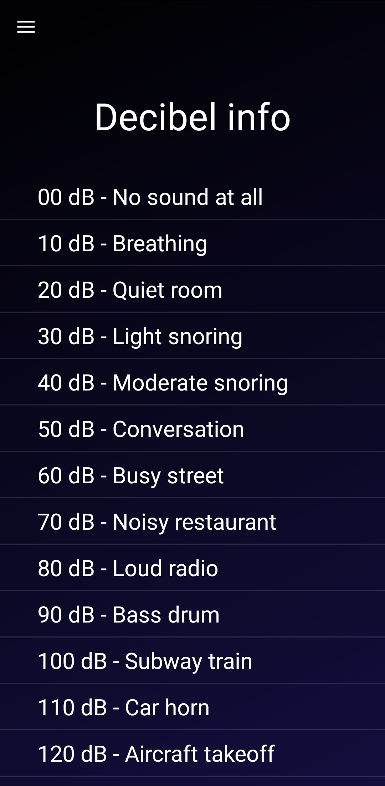

### Welcome to Decibel Meter App!
Decibel meter app is made to measure decibels in an easy way by interacting with good looking interface! 
You can measure sound around you, display it's loudness, plot in on graph, see it on gauge and compare it to real life situations. 
App also allows you to read about different decibel values and how it works!

### Decibel meter
By turning app on or selecting decibel meter in apps menu, you can turn on decibel meter and start measuring sound around you. 
Decibel value of the sound will then be displayed on the screen and it will refresh every half a second. Also minimum and maximum value since turning meter on will be shown.
All values will be plotted on graph and displayed on gauge. Also, a short one line information will tell you what current decibel value means in real life.

### Menu and fragments
Application uses a good looking and user friendly menu that will allow you to switch between decibel meter, information about decibel levels and about app. 
It is all made with usage of fragments in order to make app better and more modern.

### Info about decibel levels
You don't know what different decibel meter readings mean? Fear not, this app will allow you to read about decibels and their corresponding values. 
It will tell you whether such decibel level is dangerous for you and what might happen if you become exposed to it.

### Info about app
You can also read a short information about how application works, what method of measurement it is using and what are it's limits.

